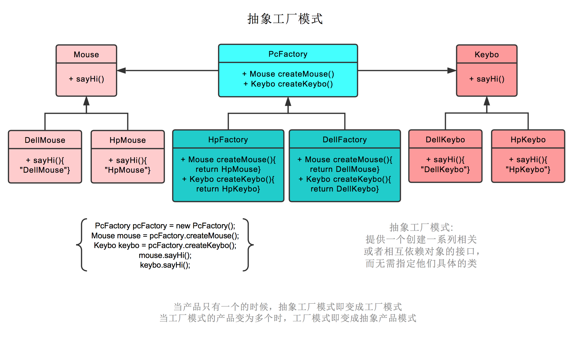

https://www.runoob.com/design-pattern/factory-pattern.html
简单工厂模式
    鼠标工厂，专业生产鼠标，给参数 0，生产戴尔鼠标，给参数 1，生产惠普鼠标。

工厂模式
    标工厂是个父类，有生产鼠标这个接口。
    戴尔鼠标工厂，惠普鼠标工厂继承它，可以分别生产戴尔鼠标，惠普鼠标。
    生产哪种鼠标不再由参数决定，而是创建鼠标工厂时，由戴尔鼠标工厂创建。

抽象工厂模式
    不仅生产鼠标，同时生产键盘。
    厂商是个父类，有生产鼠标，生产键盘两个接口。
    戴尔工厂，惠普工厂继承它，可以分别生产戴尔鼠标+戴尔键盘，和惠普鼠标+惠普键盘。

    创建工厂时，由戴尔工厂创建。
    后续工厂.生产鼠标()则生产戴尔鼠标，工厂.生产键盘()则生产戴尔键盘。

简单工厂：不能算是真正意义上的设计模式，但可以将客户程序从具体类解耦。
工厂方法：使用继承，把对象的创建委托给子类，由子类来实现创建方法，可以看作是抽象工厂模式中只有单一产品的情况。
抽象工厂：使对象的创建被实现在工厂接口所暴露出来的方法中。
工厂模式可以帮助我们针对抽象/接口编程，而不是针对具体类编程，在不同的场景下按具体情况来使用。

